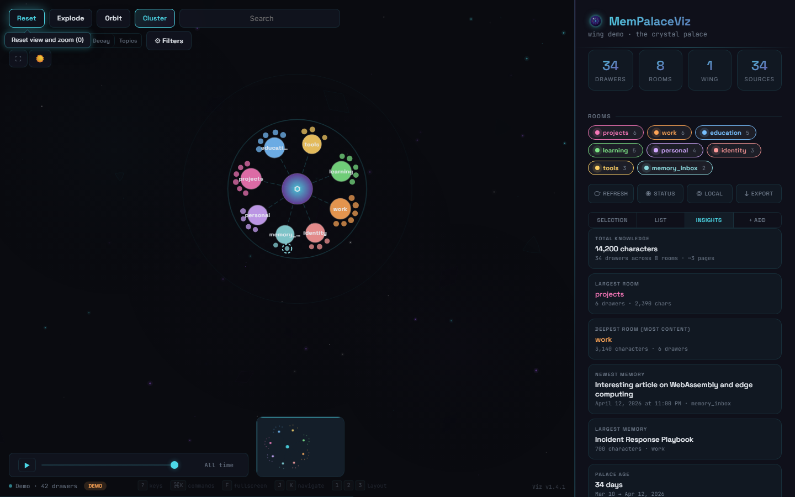

# MemPalaceViz

A futuristic knowledge graph visualization dashboard for [MemPalace](https://mempalaceofficial.com) — give your AI a memory, mine projects and conversations into a searchable palace.

Built as a single-file SPA with D3.js force-directed graphs, canvas particle effects, and real-time MCP integration. Tested against MemPalace **v3.3.3**.

> 📚 **New to MemPalace?** Start at the [official docs](https://mempalaceofficial.com/guide/getting-started.html) — installation, the AAAK memory dialect, the wing/room/drawer model, and the full MCP tool reference.

## Screenshots

| Dark Theme | Light Theme |
|:---:|:---:|
|  |  |

| Semantic Topics | Recency Heatmap |
|:---:|:---:|
|  |  |

| Drawer Detail | Drawer List |
|:---:|:---:|
|  |  |

| Themed Tooltips | Connection Settings |
|:---:|:---:|
|  |  |

| Command Palette | Mobile |
|:---:|:---:|
|  |  |

## Features

- **Force-directed graph** rendering hundreds of knowledge nodes across rooms
- **MemPalace v3.3.x integration** — paginated `list_drawers`, `get_drawer` full content, `update_drawer` inline edit, `delete_drawer` by ID
- **Connection settings** — 3-tab modal (Local Server, Hosted, Demo) with auto-detection and Test & Connect
- **Version tracker** — badge showing Viz + Palace versions, update checker via GitHub Releases and PyPI
- **Themed tooltips** — 54 glassmorphic tooltips replacing native browser titles, with dynamic arrow alignment
- **5 color modes:** Room, Recency, Size, Decay, and Semantic Topics (TF-IDF + k-means clustering)
- **3 layout modes:** Explode, Orbit, Cluster
- **Crystal Palace light theme** with sparkle particle effects
- **Fuzzy multi-token search** with date range filters
- **Structural gap detection** with Palace Health Score (0-100)
- **Drawer management:** add, edit, delete, fetch full content, find tunnels (related drawers)
- **Bulk operations:** select, export, delete multiple drawers
- **Timeline slider** with play/pause animation
- **Command palette** (Ctrl+K) with 20+ commands
- **Full keyboard navigation** (J/K, Enter, Escape, ?, F, L)
- **Mobile responsive** bottom-sheet panel with touch gestures
- **PNG screenshot capture** and JSON export
- **Zero build step** — single HTML file, all inline

## Quick Start

```bash
git clone https://github.com/JoeDoesJits/mempalace-viz.git
cd mempalace-viz

# Serve locally (any static server works)
npx http-server -p 3456 -c-1

# Open http://localhost:3456
```

On first load you'll see **demo mode** — 42 sample drawers across 8 rooms — so you can explore the UI without any server running. The real fun starts once you connect it to **your** MemPalace.

## Connecting to Your MemPalace

Click the **status pill in the bottom-left** of the dashboard to open the Connection Settings modal. Three modes:

### 🖥️ Local Server (most common)

If you're already running MemPalace locally via `mcp-proxy` (the standard setup), it's serving on `http://localhost:8000/servers/mempalace/mcp`. Just:

1. Open Connection Settings → **Local Server** tab
2. Confirm the URL (auto-filled)
3. Click **Test & Connect**

The dashboard will use the MCP `initialize` handshake, fetch your palace via `mempalace_status` + paginated `list_drawers`, and render your real knowledge graph. No config files, no tokens.

### ☁️ Hosted (remote MemPalace server)

If your MemPalace lives on a remote server (VPS, home lab, etc.), use the **Hosted** tab:

1. Enter the MCP endpoint URL
2. Paste your bearer token (if the endpoint is auth-protected)
3. Click **Test & Connect**

For a fully secure free hosting setup (Cloudflare Pages + Access + Tunnel keeps your token out of the browser entirely), see **[docs/DEPLOYMENT.md](docs/DEPLOYMENT.md)**.

### 🎯 Demo (default)

The sanitized demo dataset (`demo-palace.json`) — safe for screenshots, first-run demos, or offline exploration. No server required.

### Full v3.3.x integration

Once connected, the dashboard works against the real MCP tools — not a snapshot. Every action maps to a live tool call:

| Action | MCP tool |
|---|---|
| Load palace | `mempalace_status` + `mempalace_list_drawers` (paginated) |
| View drawer content | `mempalace_get_drawer` |
| Edit a drawer inline | `mempalace_update_drawer` |
| Delete a drawer | `mempalace_delete_drawer` |
| Add a new memory | `mempalace_add_drawer` |
| Find related drawers | `mempalace_find_tunnels` |
| Search | `mempalace_search` + `mempalace_kg_query` |

Tested against MemPalace **v3.3.3** on Python 3.12.

## Hosting Securely (Free)

**Your knowledge base is personal data. Don't expose it publicly.**

MemPalaceViz can be hosted securely and for free using Cloudflare:

- **CF Pages** — hosts the dashboard (auto-deploys from GitHub)
- **CF Access** — zero-trust auth gate (only your email gets in)
- **CF Tunnel** — connects to your MCP server with no public ports
- **CF Pages Function** — server-side proxy keeps MCP tokens out of the browser

Total cost: **$0/month** on Cloudflare's free tier.

See the full setup guide: **[docs/DEPLOYMENT.md](docs/DEPLOYMENT.md)**

See the security architecture: **[docs/SECURITY.md](docs/SECURITY.md)**

## Tech Stack

| Layer | Technology |
|-------|-----------|
| Graph | D3.js v7 (force simulation) |
| Rendering | SVG nodes + Canvas particles |
| Markdown | marked.js v15.0.7 + DOMPurify v3.2.4 |
| Clustering | Client-side TF-IDF + k-means++ |
| Theming | CSS custom properties (light/dark) |
| Fonts | Space Grotesk, Inter, JetBrains Mono |
| Hosting | Cloudflare Pages |
| Data | MCP Streamable HTTP protocol |

## Directory Structure

```
mempalace-viz/
├── index.html              # Dashboard (single-file SPA)
├── logo.svg                # Crystal orb logo (master)
├── logo.png                # Crystal orb — rendered 512×512 for Apple/OG
├── favicon.svg             # Simplified favicon for 16–32px
├── demo-palace.json        # Sanitized demo data (42 drawers)
├── robots.txt              # Disallow all crawlers
├── _headers                # X-Robots-Tag header
├── LICENSE                 # MIT
├── CHANGELOG.md
├── docs/
│   ├── DEPLOYMENT.md       # Cloudflare hosting guide
│   └── SECURITY.md         # Security architecture
├── functions/
│   └── api/mcp.js          # CF Pages Function (MCP proxy)
├── vps-deploy/             # Docker deployment config
└── .github/
    └── workflows/
        └── deploy-vps.yml  # VPS auto-deploy workflow
```

## Keyboard Shortcuts

| Key | Action |
|-----|--------|
| `1` / `2` / `3` | Explode / Orbit / Cluster layout |
| `J` / `K` | Navigate drawers (next / previous) |
| `Enter` | Open selected drawer detail |
| `Escape` | Deselect / close |
| `L` | Toggle local graph (2-hop neighborhood) |
| `F` | Toggle fullscreen |
| `R` | Refresh data |
| `?` | Keyboard reference overlay |
| `Ctrl+K` | Command palette |

## Learn More About MemPalace

MemPalaceViz is a visualization layer — it doesn't replace MemPalace itself. To get the most out of it, learn the underlying system:

- 🌐 **[Official site](https://mempalaceofficial.com)** — homepage and project overview
- 📖 **[Getting Started guide](https://mempalaceofficial.com/guide/getting-started.html)** — install, init, and mine your first palace
- 🔮 **[AAAK memory dialect](https://mempalaceofficial.com)** — the compressed memory format MemPalace uses (entity codes, emotion markers, hall/wing/room structure)
- 🛠️ **[GitHub repo](https://github.com/MemPalace/mempalace)** — source, issues, full [CHANGELOG](https://github.com/MemPalace/mempalace/blob/main/CHANGELOG.md)
- 📦 **[PyPI](https://pypi.org/project/mempalace/)** — `pip install mempalace`

## Contributing

PRs welcome! The dashboard is a single `index.html` file — all CSS, JS, and logic inline. No build step needed.

1. Fork the repo
2. `npx http-server -p 3456 -c-1` to serve locally
3. Make changes, test in browser
4. Submit a PR

## License

MIT — see [LICENSE](LICENSE)

## Author

Built by [Joe Guarino](https://g5labs.io) / G5 Labs
