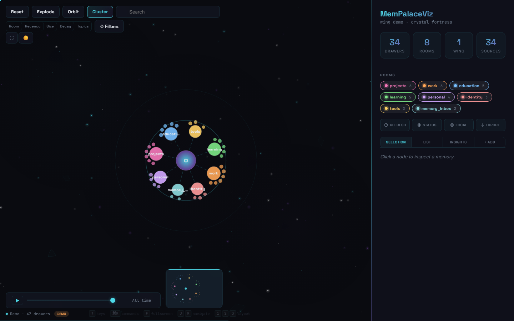
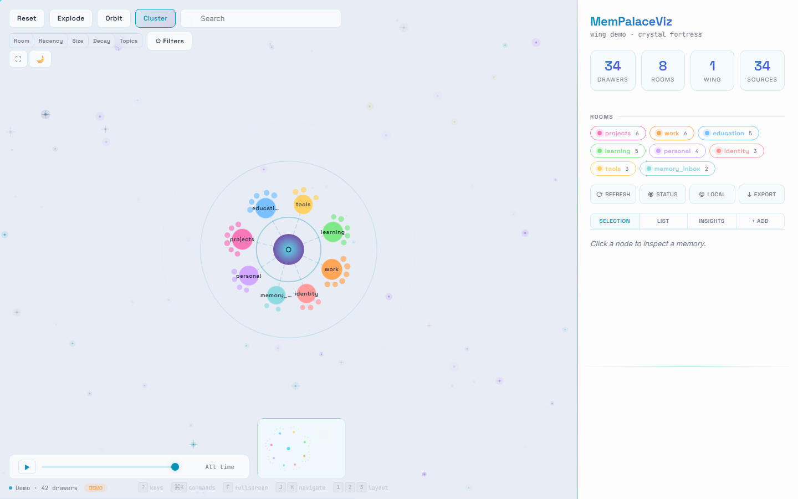
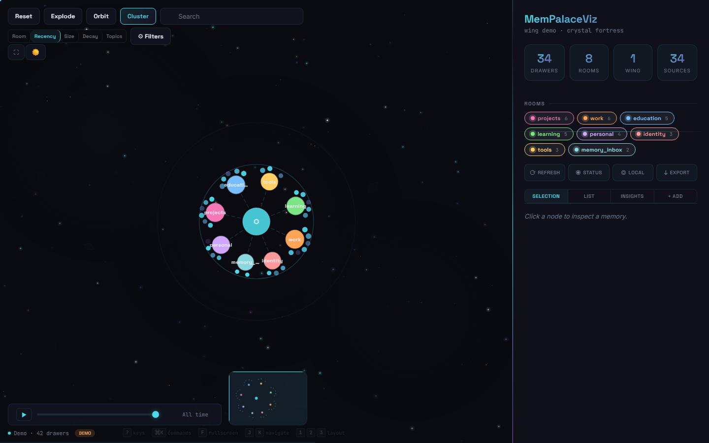
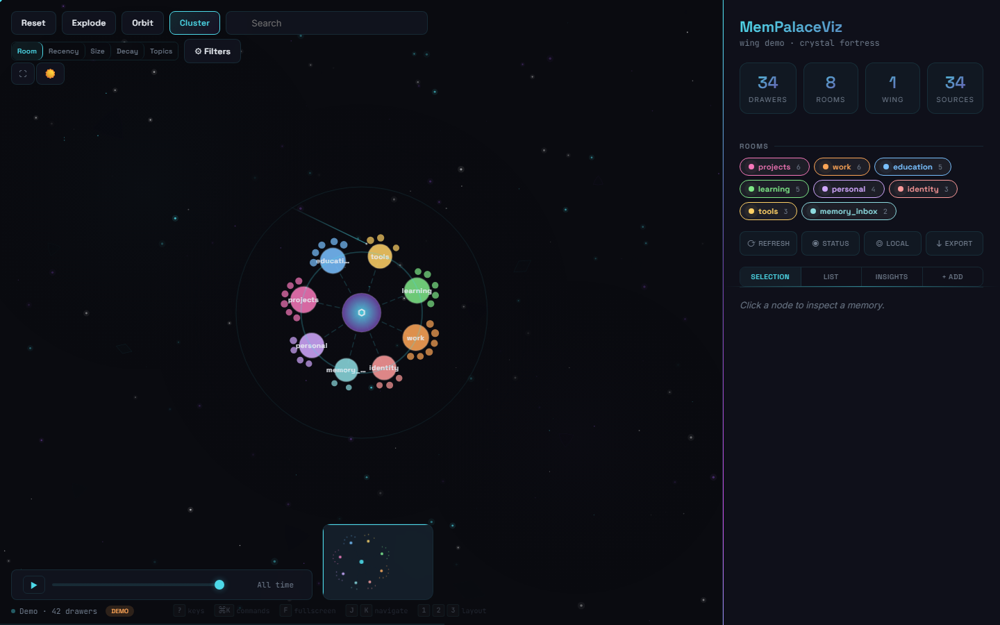
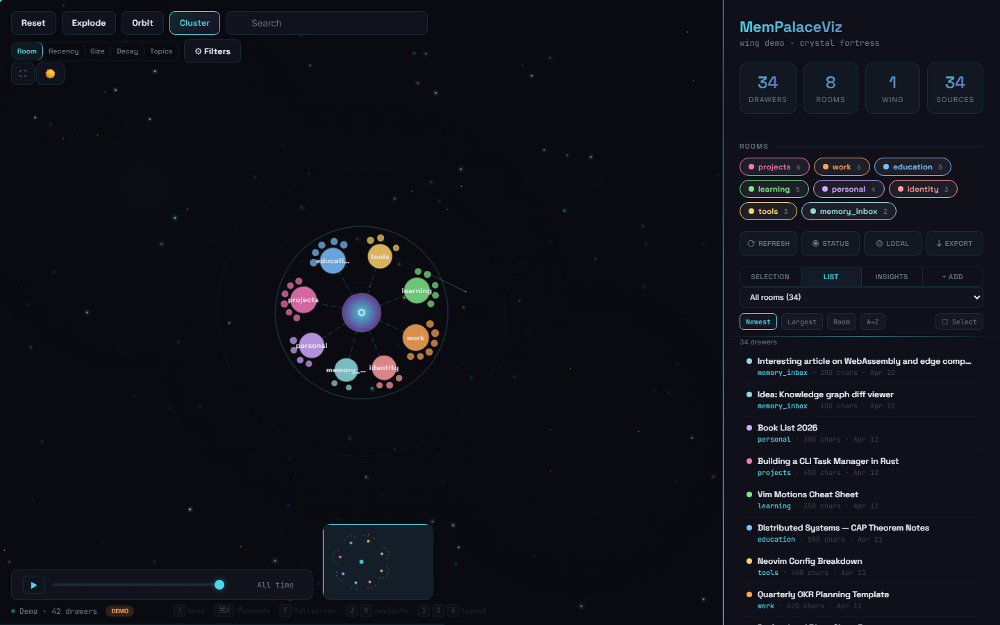
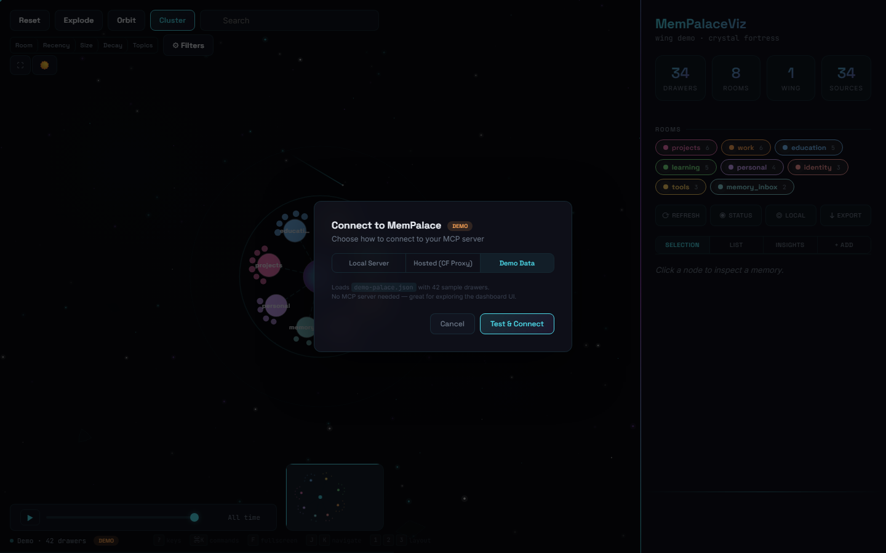
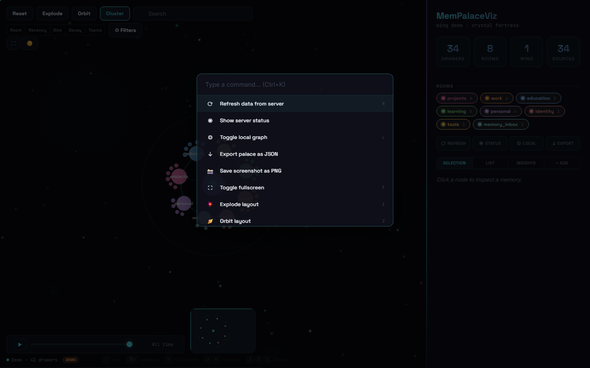
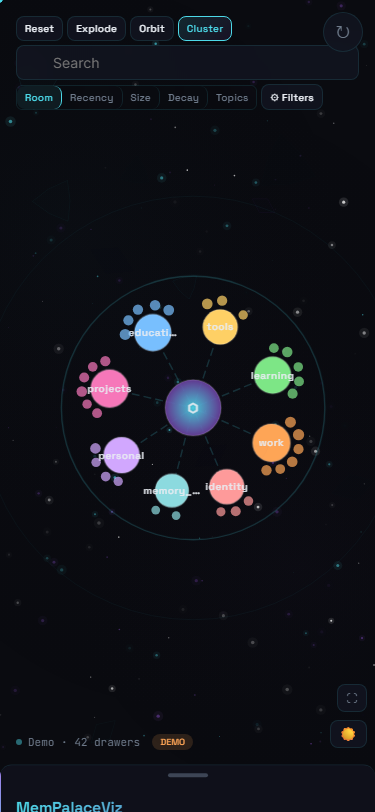

# MemPalaceViz

A futuristic knowledge graph visualization dashboard for the [MemPalace](https://github.com/basicmachines-co/basic-memory) personal knowledge base system.

Built as a single-file SPA with D3.js force-directed graphs, canvas particle effects, and real-time MCP integration.

## Screenshots

| Dark Theme | Light Theme |
|:---:|:---:|
|  |  |

| Semantic Topics | Recency Heatmap |
|:---:|:---:|
|  |  |

| Drawer Detail | Drawer List |
|:---:|:---:|
|  |  |

| Connection Settings | Command Palette | Mobile |
|:---:|:---:|:---:|
|  |  |  |

## Features

- **Force-directed graph** rendering hundreds of knowledge nodes across rooms
- **5 color modes:** Room, Recency, Size, Decay, and Semantic Topics (TF-IDF + k-means clustering)
- **3 layout modes:** Explode, Orbit, Cluster
- **Crystal Palace light theme** with sparkle particle effects
- **Fuzzy multi-token search** with date range filters
- **Structural gap detection** with Palace Health Score (0-100)
- **Live MCP integration** for real-time data from MemPalace server
- **Drawer management:** add, delete, find tunnels (related drawers)
- **Bulk operations:** select, export, delete multiple drawers
- **Timeline slider** with play/pause animation
- **Command palette** (Ctrl+K) with 19 commands
- **Full keyboard navigation** (J/K, Enter, Escape, ?, F, L)
- **Mobile responsive** bottom-sheet panel with touch gestures
- **PNG screenshot capture** and JSON export
- **Zero build step** — single HTML file, all inline

## Quick Start

```bash
git clone https://github.com/JoeDoesJits/mempalace-viz.git
cd mempalace-viz

# Serve locally (any static server works)
npx http-server -p 3456 -c-1

# Open http://localhost:3456
```

The dashboard automatically loads `demo-palace.json` with sample data if no MCP server is available.

## Demo Mode

MemPalaceViz ships with a sanitized demo dataset (`demo-palace.json`) containing 42 sample drawers across 8 rooms. This loads automatically when no MCP server is reachable.

To use your own data, either:
1. Connect a MemPalace MCP server (see [Deployment Guide](docs/DEPLOYMENT.md))
2. Replace `demo-palace.json` with your own data in the same format

## Hosting Securely (Free)

**Your knowledge base is personal data. Don't expose it publicly.**

MemPalaceViz can be hosted securely and for free using Cloudflare:

- **CF Pages** — hosts the dashboard (auto-deploys from GitHub)
- **CF Access** — zero-trust auth gate (only your email gets in)
- **CF Tunnel** — connects to your MCP server with no public ports
- **CF Pages Function** — server-side proxy keeps MCP tokens out of the browser

Total cost: **$0/month** on Cloudflare's free tier.

See the full setup guide: **[docs/DEPLOYMENT.md](docs/DEPLOYMENT.md)**

See the security architecture: **[docs/SECURITY.md](docs/SECURITY.md)**

## Tech Stack

| Layer | Technology |
|-------|-----------|
| Graph | D3.js v7 (force simulation) |
| Rendering | SVG nodes + Canvas particles |
| Markdown | marked.js v15.0.7 + DOMPurify v3.2.4 |
| Clustering | Client-side TF-IDF + k-means++ |
| Theming | CSS custom properties (light/dark) |
| Fonts | Space Grotesk, Inter, JetBrains Mono |
| Hosting | Cloudflare Pages |
| Data | MCP Streamable HTTP protocol |

## Directory Structure

```
mempalace-viz/
├── index.html              # Dashboard (single-file SPA)
├── logo.png                # Crystal prism favicon
├── demo-palace.json        # Sanitized demo data (42 drawers)
├── robots.txt              # Disallow all crawlers
├── _headers                # X-Robots-Tag header
├── LICENSE                 # MIT
├── CHANGELOG.md
├── docs/
│   ├── DEPLOYMENT.md       # Cloudflare hosting guide
│   └── SECURITY.md         # Security architecture
├── functions/
│   └── api/mcp.js          # CF Pages Function (MCP proxy)
├── vps-deploy/             # Docker deployment config
└── .github/
    └── workflows/
        └── deploy-vps.yml  # VPS auto-deploy workflow
```

## Keyboard Shortcuts

| Key | Action |
|-----|--------|
| `1` / `2` / `3` | Explode / Orbit / Cluster layout |
| `J` / `K` | Navigate drawers (next / previous) |
| `Enter` | Open selected drawer detail |
| `Escape` | Deselect / close |
| `L` | Toggle local graph (2-hop neighborhood) |
| `F` | Toggle fullscreen |
| `R` | Refresh data |
| `?` | Keyboard reference overlay |
| `Ctrl+K` | Command palette |

## Contributing

PRs welcome! The dashboard is a single `index.html` file — all CSS, JS, and logic inline. No build step needed.

1. Fork the repo
2. `npx http-server -p 3456 -c-1` to serve locally
3. Make changes, test in browser
4. Submit a PR

## License

MIT — see [LICENSE](LICENSE)

## Author

Built by [Joe Guarino](https://g5labs.io) / G5 Labs
